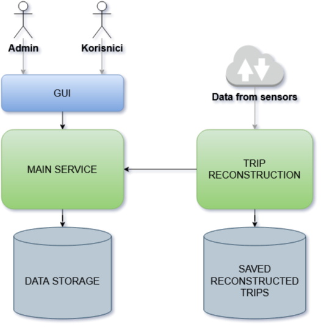

<h1 align="center">Autoceste frontend</h1>

    
    

---

This project was made as a student assignment and was used as an opportunity to learn and practice software development and different technologies like Spring Boot, React, Java, Javascript, Mongo, PostgreSQL, Hibernate, and others. The assignment was to propose an architecture and implement a web service that will receive data from several DSRC readers, ALPR cameras, and vehicle classifiers in a pre-know structured form. Also, web service has to support an account for highway users where user can register vehicles and receive invoices for trips made on the highway. The administrator should have the ability to set prices for different sections of highways and define discounts. So for implementing this small enterprise system I decide to have the following architecture.

# Project components

| Components                                                                      | Description
| ------------------------------------------------------------------------------  | -------------
| [Main](https://github.com/stjepanB/autocesteBackend)                            | REST API for user and admin        |
| [Reconstruction](https://github.com/stjepanB/autocesteTripReconstructionService)| REST API for collecting data from sensors|
| [GUI ](https://github.com/stjepanB/autocesteFrontend)                           | Static server with JSX files       |
| [Generator](https://github.com/stjepanB/tripGenerator)                          | Python script that generates trips |

--- 
This project was made by [Stjepan Benčić](https://www.linkedin.com/in/stjepan-bencic/)
